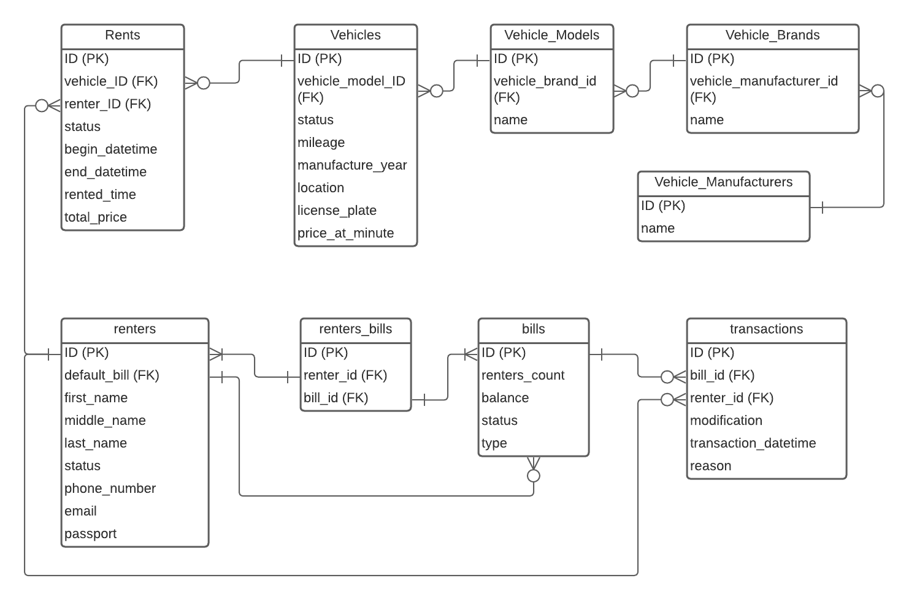

# Laravel Carsharing 1.0

## Содержание
- [Развертывание / Установка](#install)
    - [Проблемы при развертывании](#troubleshoting)
- [Документация к API](#swagger)
- [Структура и описание предметной области](#er)

## Развертывание / Установка

Для установки проекта необходимо следующее:

- Установленный `PHP`
- Установленный `Composer`

Чтобы развернуть проект, следуйте этой инструкции:  
*Для удобства, в этом проекте я использую `sail`*

1. Установите все зависимости `Composer` при помощи команды `composer update`
2. Расшифруйте `.env` файл при помощи ключа.
>Ключ: `base64:tBifRYWBzjAKoDpYirPChhcli3dySoxhlp+9ardjk18=`  
>Команда: (`sail artisan env:encrypt --key=<ключ>`)
3. Запустите проект `sail up`
4. Выполните миграции и заполните модели даннми: `sail artisan migrate --seed`

### Проблемы при развертывании

#### DETAIL:  Role "sail" does not exist.

Проблема возникает, когда настройки PostgreSQL не обновлены текущим `.env` файлом. 

После развертывания приложения необходимо очистить предыдущую конфигурацию, которая хранится в томе Docker.

1. Расшифруйте `.env` файл.
2. Удалите все тома Docker и остановите все контейнеры командой: `sail down -v`.
3. Запустите приложение снова.

## Документация API

Документация SWAGGER к API будет доступна на `/api/documentation`, после запуска приложения.

## Структура и описание предметной области

### ER Диаграмма

### Таблицы

#### Vehicle_manufacturers - Производители ТС

- `ID` - первичный ключ
- `name` - название производителя ТС

#### Vehicle_brands - Бренды ТС

- `ID` - первичный ключ
- `manufacturer_id` - внешний ключ для связи с `vehicle_manufacturers`
- `name` - название бренда ТС

#### Vehicle_models - Модели ТС

- `ID` - первичный ключ
- `brand_id` - внешний ключ для связи с `vehicle_brands`
- `name` - название модели ТС

#### Vehicles - Транспортные средства

- `ID` - первичный ключ
- `model_id` - внешний ключ для связи с `vehicle_models`
- `status` - статус ТС
- `mileage` - пробег ТС
- `location` - координаты ТС
- `license_plate` - гос. номер ТС
- `prise_at_hour` - цена за час аренды

#### Rents - информация об арендах

- `ID` - первичный ключ
- `vehicle_id` - внешний ключ для связи с `vehicles`
- `renter_id` - внешний ключ для связи с `renters`
- `status` - статус аренды (открыт, закрыт)
- `begin_datetime` - дата и время начала аренды
- `end_datetime` - дата и время конца аренды
- `rented_time` - общее время (длительность) аренды
- `total_price` - итоговая цена за аренду

#### Renters - арендаторы

- `ID` - первичный ключ
- `first_name` - имя
- `middle_name` - фамилия
- `last_name` - отчество
- `status` - статус пользователя (активный, бан, заморожен)
- `email` - номер телефона пользователя
- `end_datetime` - email
- `passport` - серия и номер паспорта

#### Renters_bills - Промежуточная таблица для связи "МкМ"

- `ID` - первичный ключ
- `renter_id` - внешний ключ для связи с `renters`
- `bill_id` - внешний ключ для связи с `bills`

#### Bills - Счета

- `ID` - первичный ключ
- `renter_id` - внешний ключ для связи с `renters`
- `renters_count` - колличество пользователей привязаных к счету
- `type` - тип счета
- `balance` - баланс счета
- `status` - статус счета (открыт, заморожен, заблокирован, закрыт)

#### Transactions - Операции со счетами

- `ID` - первичный ключ
- `bill_id` - внешний ключ для связи с `bills`
- `renter_id` - внешний ключ для связи с `renters`
- `modification` - изменение баланса (отрицательное значение для снятия, положительное для пополнения)
- `transaction_datetime` - дата и время операции со счетом
- `reason` - причина операции (долг, снятие за аренду, пополнение с карты и т.д.)
